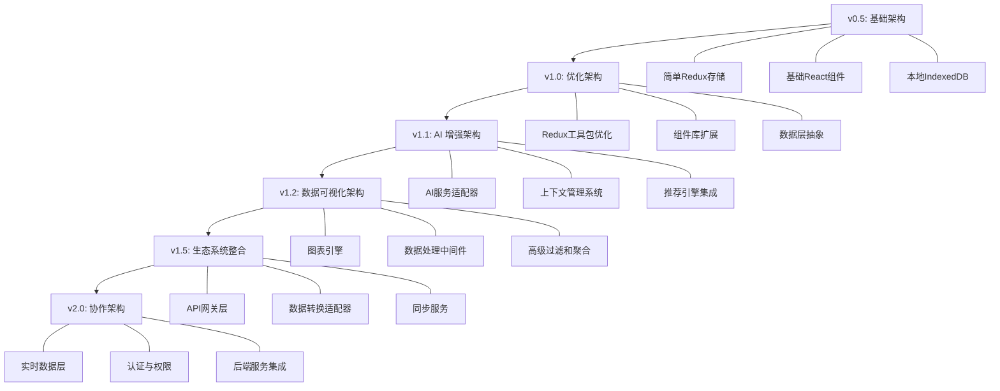
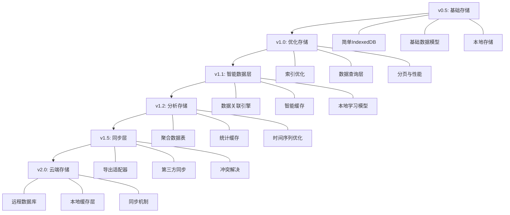

### 🤖 Assistant


# AI 管理天地：产品规格补充文档

## 目录
1. [风险评估与缓解策略](#风险评估与缓解策略)
2. [性能优化策略](#性能优化策略)
3. [无障碍设计规范](#无障碍设计规范)
4. [版本演进路线图](#版本演进路线图)
5. [用户测试方案](#用户测试方案)
6. [数据验证机制](#数据验证机制)

<a id="风险评估与缓解策略"></a>
## 1. 风险评估与缓解策略

### 1.1 技术风险

| 风险类别 | 风险描述 | 影响程度 | 缓解策略 |
|---------|---------|---------|---------|
| **数据存储** | IndexedDB 存储上限导致数据丢失 | 高 | • 实施分区存储策略<br>• 定期数据清理机制<br>• 导出/备份重要数据功能<br>• 存储空间监控与预警 |
| **API 依赖** | Open Router API 服务中断或变更 | 高 | • 实现离线功能降级机制<br>• 缓存最近对话以备服务中断时使用<br>• 设置 API 超时与重试逻辑<br>• 监控 API 服务状态 |
| **浏览器兼容性** | 跨浏览器功能差异导致体验不一致 | 中 | • 兼容性测试覆盖所有目标浏览器<br>• 使用 polyfills 和 fallbacks<br>• 特性检测而非浏览器检测<br>• 核心功能渐进增强 |
| **UI 复杂度** | 多视图和数据联动导致渲染性能问题 | 中 | • 组件懒加载与代码分割<br>• 虚拟列表优化<br>• 防抖与节流处理<br>• 性能监测与渲染优化 |
| **离线功能** | 用户网络不稳定导致数据同步问题 | 中 | • 优化离线使用体验<br>• 提供明确的网络状态指示<br>• 实现冲突解决策略<br>• 自动重试机制 |
| **安全隐患** | 敏感数据在客户端存储的安全风险 | 中 | • 敏感数据加密存储<br>• 提供数据清理选项<br>• 明确隐私政策<br>• 定期安全审查 |

### 1.2 用户体验风险

| 风险类别 | 风险描述 | 影响程度 | 缓解策略 |
|---------|---------|---------|---------|
| **功能过载** | 功能过多导致用户学习曲线陡峭 | 高 | • 分阶段引导功能探索<br>• 提供交互式教程<br>• 简化初始界面<br>• 渐进式功能暴露 |
| **交互复杂性** | 多维度数据管理操作流程复杂 | 中 | • 简化关键任务流程<br>• 上下文相关帮助<br>• 一致的交互模式<br>• 用户行为分析优化 |
| **AI 效果不佳** | AI 回应质量不符合用户期望 | 中 | • 明确设置用户期望<br>• 提供反馈与调整机制<br>• 预设高质量提示模板<br>• 持续优化模型选择 |
| **数据可视化** | 统计图表难以理解或解读 | 低 | • 简化数据展示<br>• 提供上下文解释<br>• 互动式图表教程<br>• 用户测试驱动改进 |
| **响应性能** | 复杂操作响应延迟影响体验 | 中 | • 乐观 UI 更新<br>• 明确的加载状态<br>• 后台处理重任务<br>• 性能指标监控 |

### 1.3 产品风险

| 风险类别 | 风险描述 | 影响程度 | 缓解策略 |
|---------|---------|---------|---------|
| **需求混乱** | 多功能整合导致核心价值模糊 | 高 | • 明确核心价值主张<br>• 基于用户旅程的功能整合<br>• 关注关键场景优化<br>• 定期用户反馈收集 |
| **市场定位** | 产品定位过宽导致竞争力分散 | 中 | • 突出差异化特色<br>• 聚焦关键用户群体<br>• 持续市场分析<br>• 定期产品战略评估 |
| **开发资源** | 功能实现范围过大超出资源能力 | 中 | • 核心功能优先<br>• MVP 策略实施<br>• 模块化架构便于扩展<br>• 灵活调整开发计划 |
| **合规问题** | AI 使用涉及的隐私和合规风险 | 高 | • 定期法律合规审查<br>• 明确数据使用政策<br>• 用户可控的隐私设置<br>• 合规文档维护 |

### 1.4 风险监控机制

- **技术健康仪表板**：实时监控关键技术指标（存储使用、API 响应时间、错误率）
- **用户体验监控**：通过事件跟踪和会话录制分析用户痛点
- **异常报告系统**：自动捕获并分类前端错误
- **定期风险评估**：每个迭代周期结束进行风险复盘和调整
- **早期用户反馈渠道**：为核心用户群提供便捷的问题反馈机制

<a id="性能优化策略"></a>
## 2. 性能优化策略

### 2.1 IndexedDB 性能优化

#### 2.1.1 数据存储优化
```javascript
// src/services/db-optimization.ts

// 批量操作优化
export async function bulkAddItems(storeName, items) {
  const db = await dbPromise;
  const tx = db.transaction(storeName, 'readwrite');
  const store = tx.objectStore(storeName);
  
  // 并行处理所有添加操作
  await Promise.all(items.map(item => store.add(item)));
  await tx.complete;
}

// 使用游标进行大数据集分页处理
export async function getItemsPaginated(storeName, pageIndex, pageSize) {
  const db = await dbPromise;
  const tx = db.transaction(storeName, 'readonly');
  const store = tx.objectStore(storeName);
  
  // 计算要跳过的记录数
  const skip = pageIndex * pageSize;
  let cursor = await store.openCursor();
  let counter = 0;
  
  // 跳过之前的记录
  while (cursor && counter < skip) {
    cursor = await cursor.continue();
    counter++;
  }
  
  // 获取当前页的记录
  const results = [];
  while (cursor && results.length < pageSize) {
    results.push(cursor.value);
    cursor = await cursor.continue();
  }
  
  return results;
}

// 使用索引优化常见查询
export async function getTasksDueThisWeek() {
  const db = await dbPromise;
  const tx = db.transaction('tasks', 'readonly');
  const dueIndex = tx.objectStore('tasks').index('dueDate');
  
  const today = new Date();
  const endOfWeek = new Date(today);
  endOfWeek.setDate(today.getDate() + (7 - today.getDay()));
  endOfWeek.setHours(23, 59, 59, 999);
  
  const range = IDBKeyRange.bound(today, endOfWeek);
  return dueIndex.getAll(range);
}
```

#### 2.1.2 数据清理与维护
```javascript
// src/services/db-maintenance.ts

// 清理过期的会话数据
export async function cleanupOldConversations(daysToKeep = 30) {
  const db = await dbPromise;
  const tx = db.transaction('conversations', 'readwrite');
  const store = tx.objectStore('conversations');
  const index = store.index('updatedAt');
  
  const cutoffDate = new Date();
  cutoffDate.setDate(cutoffDate.getDate() - daysToKeep);
  
  let cursor = await index.openCursor(IDBKeyRange.upperBound(cutoffDate));
  
  let count = 0;
  while (cursor) {
    await cursor.delete();
    cursor = await cursor.continue();
    count++;
  }
  
  return count; // 返回清理的记录数量
}

// 数据压缩 - 移除冗余字段或压缩大文本内容
export async function compressNoteContent(noteId) {
  const db = await dbPromise;
  const tx = db.transaction('notes', 'readwrite');
  const store = tx.objectStore('notes');
  
  const note = await store.get(noteId);
  if (!note) return false;
  
  // 如果内容超过特定大小，考虑压缩
  if (note.content && note.content.length > 10000) {
    // 使用简单压缩算法 (实际应用中可使用更高效的压缩库)
    note.content = compressText(note.content);
    note.isCompressed = true;
    await store.put(note);
    return true;
  }
  
  return false;
}

// 存储空间监控
export async function getDatabaseSize() {
  const db = await dbPromise;
  const storeNames = db.objectStoreNames;
  let totalSize = 0;
  
  for (const storeName of storeNames) {
    const tx = db.transaction(storeName, 'readonly');
    const store = tx.objectStore(storeName);
    const allRecords = await store.getAll();
    
    // 估算存储大小
    const storeSize = allRecords.reduce((size, record) => {
      return size + estimateObjectSize(record);
    }, 0);
    
    totalSize += storeSize;
  }
  
  return {
    totalSizeBytes: totalSize,
    totalSizeMB: (totalSize / (1024 * 1024)).toFixed(2),
    quota: await navigator.storage.estimate()
  };
}
```

### 2.2 渲染性能优化

#### 2.2.1 React 组件优化
```javascript
// src/components/optimization/MemoizedComponent.tsx
import React, { useMemo, useCallback, memo } from 'react';

// 使用 memo 避免不必要的重新渲染
const TaskItem = memo(({ task, onStatusChange }) => {
  // 使用 useCallback 确保函数引用稳定
  const handleStatusChange = useCallback((newStatus) => {
    onStatusChange(task.id, newStatus);
  }, [task.id, onStatusChange]);
  
  // 使用 useMemo 缓存复杂计算
  const taskPriorityClass = useMemo(() => {
    switch (task.priority) {
      case 'high': return 'bg-red-100 text-red-800';
      case 'medium': return 'bg-yellow-100 text-yellow-800';
      case 'low': return 'bg-green-100 text-green-800';
      default: return '';
    }
  }, [task.priority]);
  
  return (
    <div className={`task-item p-3 rounded-lg mb-2 ${taskPriorityClass}`}>
      <h4>{task.title}</h4>
      <p>{task.description}</p>
      <select 
        value={task.status} 
        onChange={(e) => handleStatusChange(e.target.value)}
      >
        <option value="to-do">待办</option>
        <option value="in-progress">进行中</option>
        <option value="completed">已完成</option>
      </select>
    </div>
  );
});

export default TaskItem;
```

#### 2.2.2 列表渲染优化
```javascript
// src/components/optimization/VirtualizedList.tsx
import React, { useState, useEffect, useRef } from 'react';

interface VirtualizedListProps<T> {
  items: T[];
  itemHeight: number;
  renderItem: (item: T, index: number) => React.ReactNode;
  windowHeight: number;
  overscan?: number;
}

function VirtualizedList<T>({
  items,
  itemHeight,
  renderItem,
  windowHeight,
  overscan = 3
}: VirtualizedListProps<T>) {
  const [scrollTop, setScrollTop] = useState(0);
  const containerRef = useRef<HTMLDivElement>(null);
  
  // 监听滚动事件
  useEffect(() => {
    const container = containerRef.current;
    if (!container) return;
    
    const handleScroll = () => {
      setScrollTop(container.scrollTop);
    };
    
    container.addEventListener('scroll', handleScroll);
    return () => container.removeEventListener('scroll', handleScroll);
  }, []);
  
  // 计算可见范围
  const totalHeight = items.length * itemHeight;
  const startIndex = Math.max(0, Math.floor(scrollTop / itemHeight) - overscan);
  const endIndex = Math.min(
    items.length - 1,
    Math.floor((scrollTop + windowHeight) / itemHeight) + overscan
  );
  
  // 只渲染可见区域的元素
  const visibleItems = items.slice(startIndex, endIndex + 1).map((item, index) => {
    const actualIndex = startIndex + index;
    return (
      <div
        key={actualIndex}
        style={{
          position: 'absolute',
          top: actualIndex * itemHeight,
          height: itemHeight,
          left: 0,
          right: 0
        }}
      >
        {renderItem(item, actualIndex)}
      </div>
    );
  });
  
  return (
    <div
      ref={containerRef}
      style={{
        height: windowHeight,
        overflow: 'auto',
        position: 'relative'
      }}
    >
      <div style={{ height: totalHeight, position: 'relative' }}>
        {visibleItems}
      </div>
    </div>
  );
}

export default VirtualizedList;
```

#### 2.2.3 事件处理优化
```javascript
// src/utils/performance.ts

// 防抖函数 - 用于处理频繁触发的事件
export function debounce<T extends (...args: any[]) => any>(
  func: T,
  wait: number
): (...args: Parameters<T>) => void {
  let timeout: ReturnType<typeof setTimeout> | null = null;
  
  return function(...args: Parameters<T>) {
    const later = () => {
      timeout = null;
      func(...args);
    };
    
    if (timeout !== null) {
      clearTimeout(timeout);
    }
    timeout = setTimeout(later, wait);
  };
}

// 节流函数 - 用于限制事件触发频率
export function throttle<T extends (...args: any[]) => any>(
  func: T,
  limit: number
): (...args: Parameters<T>) => void {
  let inThrottle = false;
  
  return function(...args: Parameters<T>) {
    if (!inThrottle) {
      func(...args);
      inThrottle = true;
      setTimeout(() => {
        inThrottle = false;
      }, limit);
    }
  };
}

// 在搜索输入框中使用
export const optimizedSearchHandler = debounce((searchTerm: string) => {
  // 执行搜索逻辑
  console.log('Searching for:', searchTerm);
}, 300);

// 在滚动事件中使用
export const optimizedScrollHandler = throttle(() => {
  // 处理滚动逻辑
  console.log('Scroll event processed');
}, 100);
```

### 2.3 资源加载优化

#### 2.3.1 代码分割与懒加载
```javascript
// src/App.tsx
import React, { lazy, Suspense } from 'react';
import { BrowserRouter, Routes, Route } from 'react-router-dom';
import Layout from './components/Layout';
import LoadingSpinner from './components/ui/LoadingSpinner';

// 懒加载各功能页面
const AIChat = lazy(() => import('./pages/AIChat'));
const Pomodoro = lazy(() => import('./pages/Pomodoro'));
const Notebook = lazy(() => import('./pages/Notebook'));
const TaskCenter = lazy(() => import('./pages/TaskCenter'));
const ProjectManagement = lazy(() => import('./pages/ProjectManagement'));
const Settings = lazy(() => import('./pages/Settings'));

function App() {
  return (
    <BrowserRouter>
      <Routes>
        <Route path="/" element={<Layout />}>
          <Route index element={
            <Suspense fallback={<LoadingSpinner />}>
              <AIChat />
            </Suspense>
          } />
          <Route path="pomodoro" element={
            <Suspense fallback={<LoadingSpinner />}>
              <Pomodoro />
            </Suspense>
          } />
          <Route path="notebook" element={
            <Suspense fallback={<LoadingSpinner />}>
              <Notebook />
            </Suspense>
          } />
          <Route path="tasks" element={
            <Suspense fallback={<LoadingSpinner />}>
              <TaskCenter />
            </Suspense>
          } />
          <Route path="projects" element={
            <Suspense fallback={<LoadingSpinner />}>
              <ProjectManagement />
            </Suspense>
          } />
          <Route path="settings" element={
            <Suspense fallback={<LoadingSpinner />}>
              <Settings />
            </Suspense>
          } />
        </Route>
      </Routes>
    </BrowserRouter>
  );
}

export default App;
```

#### 2.3.2 图像优化
```javascript
// src/components/optimization/OptimizedImage.tsx
import React, { useState, useEffect } from 'react';

interface OptimizedImageProps {
  src: string;
  alt: string;
  width: number;
  height: number;
  className?: string;
}

const OptimizedImage: React.FC<OptimizedImageProps> = ({
  src,
  alt,
  width,
  height,
  className = ''
}) => {
  const [loaded, setLoaded] = useState(false);
  
  // 生成响应式图像 URL
  const generateResponsiveUrl = (url: string, width: number): string => {
    // 这里可以根据实际需求生成不同尺寸的图像 URL
    // 例如使用 Cloudinary, Imgix 等服务
    return `${url}?w=${width}`;
  };
  
  return (
    <div 
      className={`relative ${className}`} 
      style={{ width, height }}
    >
      {/* 低质量图像占位符 */}
      {!loaded && (
        <div 
          className="absolute inset-0 bg-gray-200 animate-pulse"
          style={{ width, height }}
        />
      )}
      
      {/* 实际图像 */}
       setLoaded(true)}
        className={`transition-opacity duration-300 ${loaded ? 'opacity-100' : 'opacity-0'}`}
      />
    </div>
  );
};

export default OptimizedImage;
```

### 2.4 性能监控与分析

```javascript
// src/utils/performance-monitoring.ts

// 初始化性能监控
export function initPerformanceMonitoring() {
  // 页面加载性能
  window.addEventListener('load', () => {
    setTimeout(() => {
      const timing = performance.getEntriesByType('navigation')[0] as PerformanceNavigationTiming;
      
      const performanceMetrics = {
        // DNS 查询时间
        dnsTime: timing.domainLookupEnd - timing.domainLookupStart,
        // TCP 连接时间
        tcpTime: timing.connectEnd - timing.connectStart,
        // 请求响应时间
        responseTime: timing.responseEnd - timing.responseStart,
        // DOM 处理时间
        domProcessingTime: timing.domComplete - timing.domInteractive,
        // 页面加载总时间
        loadTime: timing.loadEventEnd - timing.navigationStart,
        // 首次内容绘制
        fcp: getFirstContentfulPaint(),
        // 首次输入延迟
        fid: getFirstInputDelay()
      };
      
      // 记录性能指标
      logPerformanceMetrics('page_load', performanceMetrics);
    }, 0);
  });
  
  // 监控长任务
  observeLongTasks();
  
  // 监控内存使用
  monitorMemoryUsage();
}

// 获取首次内容绘制时间
function getFirstContentfulPaint() {
  const paintEntries = performance.getEntriesByType('paint');
  const fcpEntry = paintEntries.find(entry => entry.name === 'first-contentful-paint');
  return fcpEntry ? fcpEntry.startTime : 0;
}

// 获取首次输入延迟
function getFirstInputDelay() {
  // 实际应用中应使用 web-vitals 库获取更准确的 FID
  return 0;
}

// 观察长任务
function observeLongTasks() {
  const observer = new PerformanceObserver((list) => {
    for (const entry of list.getEntries()) {
      if (entry.duration > 50) { // 50ms 以上视为长任务
        logPerformanceMetrics('long_task', {
          duration: entry.duration,
          startTime: entry.startTime,
          name: entry.name
        });
      }
    }
  });
  
  observer.observe({ entryTypes: ['longtask'] });
}

// 监控内存使用
function monitorMemoryUsage() {
  if (performance.memory) {
    setInterval(() => {
      const memoryInfo = {
        totalJSHeapSize: performance.memory.totalJSHeapSize,
        usedJSHeapSize: performance.memory.usedJSHeapSize,
        jsHeapSizeLimit: performance.memory.jsHeapSizeLimit
      };
      
      logPerformanceMetrics('memory_usage', memoryInfo);
    }, 60000); // 每分钟记录一次
  }
}

// 记录性能指标
function logPerformanceMetrics(metricType, data) {
  // 在实际应用中，可以将数据发送到分析服务
  console.log(`[Performance] ${metricType}:`, data);
  
  // 如果数据超出阈值，触发警告
  checkPerformanceThresholds(metricType, data);
}

// 检查性能阈值
function checkPerformanceThresholds(metricType, data) {
  const thresholds = {
    page_load: { loadTime: 3000 }, // 页面加载超过 3 秒触发警告
    long_task: { duration: 100 },  // 任务执行超过 100ms 触发警告
    memory_usage: { usedJSHeapPercentage: 0.8 } // 内存使用超过 80% 触发警告
  };
  
  if (metricType === 'page_load' && data.loadTime > thresholds.page_load.loadTime) {
    console.warn(`页面加载时间过长: ${data.loadTime}ms`);
  }
  
  if (metricType === 'long_task' && data.duration > thresholds.long_task.duration) {
    console.warn(`检测到长任务: ${data.duration}ms`);
  }
  
  if (metricType === 'memory_usage') {
    const usedPercentage = data.usedJSHeapSize / data.jsHeapSizeLimit;
    if (usedPercentage > thresholds.memory_usage.usedJSHeapPercentage) {
      console.warn(`内存使用率过高: ${(usedPercentage * 100).toFixed(1)}%`);
    }
  }
}
```

<a id="无障碍设计规范"></a>
## 3. 无障碍设计规范

### 3.1 无障碍设计原则

#### 3.1.1 WCAG 2.1 合规目标
- **可感知性**：内容和界面元素必须以多种方式呈现，以适应不同感知能力
- **可操作性**：用户界面和导航必须可通过多种方式操作
- **可理解性**：信息和界面操作必须清晰易懂
- **健壮性**：内容必须足够健壮，能被各种辅助技术可靠解释

#### 3.1.2 优先级合规目标
- **A 级**：必须满足的基本要求（MVP 阶段）
- **AA 级**：目标合规级别（v1.0 版本）
- **AAA 级**：部分高要求特性达成（未来版本）

### 3.2 视觉无障碍

#### 3.2.1 色彩对比度
```css
/* tailwind.config.js - 自定义颜色类，确保符合 WCAG AA 标准 */
module.exports = {
  theme: {
    extend: {
      colors: {
        // 主色调，确保与白色背景对比度达到 4.5:1
        'primary': {
          DEFAULT: '#D23B42', // 更暗的红色变种，与白色对比度为 4.5:1
          'light': '#FF5A5F', // 原始色调，用于非文本元素
        },
        // 次要色调，确保与白色背景对比度达到 4.5:1
        'secondary': {
          DEFAULT: '#CC9000', // 更暗的金黄色变种，与白色对比度为 4.5:1
          'light': '#FFB400', // 原始色调，用于非文本元素
        },
        // 辅助色，确保与白色背景对比度达到 4.5:1
        'accent': {
          DEFAULT: '#0D6EFD', // 更暗的蓝色变种，与白色对比度为 4.5:1
          'light': '#3A86FF', // 原始色调，用于非文本元素
        },
        // 文本色，确保与白色背景对比度达到 7:1
        'text': {
          'primary': '#212529', // 深灰色，与白色对比度为 14:1
          'secondary': '#495057', // 中灰色，与白色对比度为 7:1
          'muted': '#6C757D', // 浅灰色，与白色对比度为 4.5:1
        },
      }
    }
  }
}
```

#### 3.2.2 字体大小与缩放支持
```css
/* src/styles/accessibility.css */

/* 确保基础字体大小可以被用户浏览器设置覆盖 */
html {
  font-size: 100%; /* 等于浏览器默认字体大小，通常为 16px */
}

/* 使用相对单位 */
body {
  font-size: 1rem; /* 相对于 html 元素的字体大小 */
  line-height: 1.5; /* 使用无单位的行高提高可读性 */
}

/* 响应式字体大小 */
h1 { font-size: clamp(1.5rem, 5vw, 2.5rem); }
h2 { font-size: clamp(1.25rem, 4vw, 2rem); }
h3 { font-size: clamp(1.125rem, 3vw, 1.75rem); }
h4 { font-size: clamp(1rem, 2vw, 1.5rem); }

/* 确保页面在 200% 缩放时仍可用 */
.container {
  width: 100%;
  max-width: 1200px;
  padding: 0 1rem;
  margin: 0 auto;
  overflow-x: hidden;
}

/* 确保聚焦元素有明显的视觉提示 */
:focus {
  outline: 3px solid #3A86FF;
  outline-offset: 2px;
}

/* 避免隐藏显示焦点轮廓 */
:focus:not(:focus-visible) {
  outline: none;
}

:focus-visible {
  outline: 3px solid #3A86FF;
  outline-offset: 2px;
}
```

#### 3.2.3 通用无障碍组件：高对比度模式切换
```tsx
// src/components/accessibility/HighContrastToggle.tsx
import React, { useEffect } from 'react';
import { useAppSelector, useAppDispatch } from '../../app/hooks';
import { toggleHighContrast } from '../../features/settings/settingsSlice';

const HighContrastToggle: React.FC = () => {
  const dispatch = useAppDispatch();
  const isHighContrast = useAppSelector(state => state.settings.isHighContrast);
  
  // 应用高对比度模式
  useEffect(() => {
    if (isHighContrast) {
      document.documentElement.classList.add('high-contrast');
    } else {
      document.documentElement.classList.remove('high-contrast');
    }
  }, [isHighContrast]);
  
  return (
    <button
      onClick={() => dispatch(toggleHighContrast())}
      className="flex items-center px-4 py-2 rounded-lg border border-gray-300"
      aria-pressed={isHighContrast}
    >
      <span className="sr-only">
        {isHighContrast ? '关闭高对比度模式' : '开启高对比度模式'}
      </span>
      <svg className="w-5 h-5 mr-2" fill="none" viewBox="0 0 24 24" stroke="currentColor">
        <path strokeLinecap="round" strokeLinejoin="round" strokeWidth={2} d="M7 21a4 4 0 01-4-4V5a2 2 0 012-2h4a2 2 0 012 2v12a4 4 0 01-4 4zm0 0h12a2 2 0 002-2v-4a2 2 0 00-2-2h-2.343M11 7.343l1.657-1.657a2 2 0 012.828 0l2.829 2.829a2 2 0 010 2.828l-8.486 8.485M7 17h.01" />
      </svg>
      高对比度
    </button>
  );
};

export default HighContrastToggle;
```

### 3.3 键盘可访问性

#### 3.3.1 键盘导航增强
```tsx
// src/components/accessibility/KeyboardNavigationHelper.tsx
import React, { useEffect } from 'react';

const KeyboardNavigationHelper: React.FC = () => {
  useEffect(() => {
    // 检测用户是否使用键盘导航
    function handleFirstTab(e: KeyboardEvent) {
      if (e.key === 'Tab') {
        document.body.classList.add('user-is-tabbing');
        window.removeEventListener('keydown', handleFirstTab);
      }
    }
    
    window.addEventListener('keydown', handleFirstTab);
    
    // 添加键盘快捷键
    function handleKeyboardShortcuts(e: KeyboardEvent) {
      // 全局帮助对话框: Shift + ?
      if (e.shiftKey && e.key === '?') {
        e.preventDefault();
        // 显示帮助对话框
        console.log('Opening help dialog');
      }
      
      // Alt+1-5 快速导航到主要功能区
      if (e.altKey && e.key >= '1' && e.key <= '5') {
        e.preventDefault();
        const index = parseInt(e.key) - 1;
        const menuItems = document.querySelectorAll('.main-nav-item');
        if (menuItems[index]) {
          (menuItems[index] as HTMLElement).click();
        }
      }
    }
    
    window.addEventListener('keydown', handleKeyboardShortcuts);
    
    return () => {
      window.removeEventListener('keydown', handleKeyboardShortcuts);
    };
  }, []);
  
  return null; // 这是一个功能性组件，不渲染任何内容
};

export default KeyboardNavigationHelper;
```

#### 3.3.2 无障碍导航菜单
```tsx
// src/components/accessibility/AccessibleMenu.tsx
import React, { useState, useRef, useEffect } from 'react';
import { Link, useLocation } from 'react-router-dom';

interface MenuItem {
  id: string;
  label: string;
  path: string;
  icon?: React.ReactNode;
  shortcut?: string;
}

interface AccessibleMenuProps {
  items: MenuItem[];
}

const AccessibleMenu: React.FC<AccessibleMenuProps> = ({ items }) => {
  const [activeIndex, setActiveIndex] = useState<number>(-1);
  const menuRefs = useRef<(HTMLAnchorElement | null)[]>([]);
  const location = useLocation();
  
  // 更新当前活动项
  useEffect(() => {
    const currentPath = location.pathname;
    const index = items.findIndex(item => item.path === currentPath);
    if (index !== -1) {
      setActiveIndex(index);
    }
  }, [location, items]);
  
  // 处理键盘导航
  const handleKeyDown = (e: React.KeyboardEvent, index: number) => {
    switch (e.key) {
      case 'ArrowDown':
        e.preventDefault();
        setActiveIndex((prevIndex) => {
          const newIndex = (prevIndex + 1) % items.length;
          menuRefs.current[newIndex]?.focus();
          return newIndex;
        });
        break;
        
      case 'ArrowUp':
        e.preventDefault();
        setActiveIndex((prevIndex) => {
          const newIndex = (prevIndex - 1 + items.length) % items.length;
          menuRefs.current[newIndex]?.focus();
          return newIndex;
        });
        break;
        
      case 'Home':
        e.preventDefault();
        setActiveIndex(0);
        menuRefs.current[0]?.focus();
        break;
        
      case 'End':
        e.preventDefault();
        setActiveIndex(items.length - 1);
        menuRefs.current[items.length - 1]?.focus();
        break;
    }
  };
  
  return (
    <nav aria-label="主导航">
      <ul className="space-y-2" role="menubar">
        {items.map((item, index) => (
          <li key={item.id} role="none">
            <Link
              to={item.path}
              ref={el => menuRefs.current[index] = el}
              role="menuitem"
              aria-current={activeIndex === index ? 'page' : undefined}
              className={`flex items-center px-4 py-2 rounded-lg transition-colors ${
                activeIndex === index 
                  ? 'bg-primary-light/10 text-primary' 
                  : 'text-text-primary hover:bg-gray-100'
              }`}
              onKeyDown={(e) => handleKeyDown(e, index)}
            >
              {item.icon && <span className="mr-3">{item.icon}</span>}
              <span>{item.label}</span>
              {item.shortcut && (
                <span className="ml-auto text-xs text-text-muted bg-gray-100 px-2 py-1 rounded">
                  {item.shortcut}
                </span>
              )}
            </Link>
          </li>
        ))}
      </ul>
    </nav>
  );
};

export default AccessibleMenu;
```

### 3.4 屏幕阅读器支持

#### 3.4.1 ARIA 角色与状态
```tsx
// src/components/accessibility/AccessibleTab.tsx
import React, { useState } from 'react';

interface TabItem {
  id: string;
  label: string;
  content: React.ReactNode;
}

interface AccessibleTabsProps {
  tabs: TabItem[];
  defaultTab?: string;
}

const AccessibleTabs: React.FC<AccessibleTabsProps> = ({ 
  tabs, 
  defaultTab = tabs[0]?.id 
}) => {
  const [activeTab, setActiveTab] = useState(defaultTab);
  
  return (
    <div className="w-full">
      {/* 标签列表 */}
      <div 
        role="tablist" 
        aria-label="内容标签"
        className="flex border-b border-gray-200"
      >
        {tabs.map(tab => (
          <button
            key={tab.id}
            id={`tab-${tab.id}`}
            role="tab"
            aria-selected={activeTab === tab.id}
            aria-controls={`panel-${tab.id}`}
            tabIndex={activeTab === tab.id ? 0 : -1}
            onClick={() => setActiveTab(tab.id)}
            className={`px-4 py-2 font-medium ${
              activeTab === tab.id
                ? 'text-primary border-b-2 border-primary'
                : 'text-text-secondary hover:text-primary'
            }`}
          >
            {tab.label}
          </button>
        ))}
      </div>
      
      {/* 内容面板 */}
      {tabs.map(tab => (
        <div
          key={tab.id}
          id={`panel-${tab.id}`}
          role="tabpanel"
          aria-labelledby={`tab-${tab.id}`}
          hidden={activeTab !== tab.id}
          tabIndex={0}
          className="p-4 focus:outline-none focus-visible:ring-2 focus-visible:ring-primary"
        >
          {tab.content}
        </div>
      ))}
    </div>
  );
};

export default AccessibleTabs;
```

#### 3.4.2 实时区域和通知
```tsx
// src/components/accessibility/LiveRegion.tsx
import React, { useState, useEffect } from 'react';

interface LiveRegionProps {
  messages: string[];
  politeness?: 'polite' | 'assertive';
  clearAfter?: number; // 毫秒
}

const LiveRegion: React.FC<LiveRegionProps> = ({ 
  messages, 
  politeness = 'polite',
  clearAfter = 5000
}) => {
  const [announcement, setAnnouncement] = useState('');
  
  useEffect(() => {
    // 当消息变化时更新公告
    if (messages.length > 0) {
      const latestMessage = messages[messages.length - 1];
      setAnnouncement(latestMessage);
      
      // 清除计时器
      const timerId = setTimeout(() => {
        setAnnouncement('');
      }, clearAfter);
      
      return () => clearTimeout(timerId);
    }
  }, [messages, clearAfter]);
  
  return (
    <div 
      aria-live={politeness}
      aria-atomic="true"
      className="sr-only"
    >
      {announcement}
    </div>
  );
};

export default LiveRegion;

// 使用示例
// src/components/tasks/TaskNotification.tsx
import React, { useState, useEffect } from 'react';
import LiveRegion from '../accessibility/LiveRegion';

const TaskNotification: React.FC<{ task?: any }> = ({ task }) => {
  const [notifications, setNotifications] = useState<string[]>([]);
  
  useEffect(() => {
    if (task?.dueDate) {
      const dueDate = new Date(task.dueDate);
      const now = new Date();
      const diffTime = dueDate.getTime() - now.getTime();
      const diffDays = Math.ceil(diffTime / (1000 * 60 * 60 * 24));
      
      if (diffDays === 1) {
        setNotifications(prev => [...prev, `提醒：任务"${task.title}"将在明天到期`]);
      } else if (diffDays === 0) {
        setNotifications(prev => [...prev, `紧急提醒：任务"${task.title}"今天到期`]);
      }
    }
  }, [task]);
  
  return <LiveRegion messages={notifications} politeness="assertive" />;
};

export default TaskNotification;
```

#### 3.4.3 跳过导航链接
```tsx
// src/components/accessibility/SkipToContent.tsx
import React, { useState } from 'react';

const SkipToContent: React.FC = () => {
  const [isFocused, setIsFocused] = useState(false);
  
  return (
    <a
      href="#main-content"
      className={`sr-only focus:not-sr-only focus:absolute focus:top-4 focus:left-4 bg-white px-4 py-2 z-50 focus:outline-none focus:ring-2 focus:ring-primary ${
        isFocused ? 'block' : ''
      }`}
      onFocus={() => setIsFocused(true)}
      onBlur={() => setIsFocused(false)}
    >
      跳到主内容
    </a>
  );
};

export default SkipToContent;

// 使用示例
// src/components/Layout.tsx
import React from 'react';
import { Outlet } from 'react-router-dom';
import Sidebar from './Sidebar';
import SkipToContent from './accessibility/SkipToContent';

const Layout: React.FC = () => {
  return (
    <div className="flex h-screen">
      <SkipToContent />
      <Sidebar />
      <main id="main-content" className="flex-grow overflow-auto">
        <Outlet />
      </main>
    </div>
  );
};

export default Layout;
```

### 3.5 无障碍功能设置

```tsx
// src/pages/AccessibilitySettings.tsx
import React from 'react';
import { useAppSelector, useAppDispatch } from '../app/hooks';
import {
  toggleHighContrast,
  toggleReduceMotion,
  toggleScreenReaderOptimization,
  setFontSize,
  setLineHeight
} from '../features/settings/settingsSlice';

const AccessibilitySettings: React.FC = () => {
  const dispatch = useAppDispatch();
  const {
    isHighContrast,
    reduceMotion,
    screenReaderOptimization,
    fontSize,
    lineHeight
  } = useAppSelector(state => state.settings);
  
  return (
    <div className="max-w-2xl mx-auto p-4">
      <h1 className="text-2xl font-bold mb-6">无障碍设置</h1>
      
      <section className="mb-8">
        <h2 className="text-xl font-semibold mb-4">显示选项</h2>
        
        <div className="space-y-4">
          {/* 高对比度模式 */}
          <div className="flex items-center justify-between">
            <div>
              <h3 className="text-lg font-medium">高对比度模式</h3>
              <p className="text-sm text-text-secondary">
                增强文本和背景的对比度，使内容更易阅读
              </p>
            </div>
            <label className="relative inline-flex items-center cursor-pointer">
              <input
                type="checkbox"
                className="sr-only peer"
                checked={isHighContrast}
                onChange={() => dispatch(toggleHighContrast())}
              />
              <div className="w-11 h-6 bg-gray-200 peer-focus:outline-none peer-focus:ring-4 peer-focus:ring-primary/50 rounded-full peer peer-checked:after:translate-x-full peer-checked:after:border-white after:content-[''] after:absolute after:top-[2px] after:left-[2px] after:bg-white after:border-gray-300 after:border after:rounded-full after:h-5 after:w-5 after:transition-all peer-checked:bg-primary"></div>
            </label>
          </div>
          
          {/* 减少动画 */}
          <div className="flex items-center justify-between">
            <div>
              <h3 className="text-lg font-medium">减少动画</h3>
              <p className="text-sm text-text-secondary">
                最小化或移除界面动画和过渡效果
              </p>
            </div>
            <label className="relative inline-flex items-center cursor-pointer">
              <input
                type="checkbox"
                className="sr-only peer"
                checked={reduceMotion}
                onChange={() => dispatch(toggleReduceMotion())}
              />
              <div className="w-11 h-6 bg-gray-200 peer-focus:outline-none peer-focus:ring-4 peer-focus:ring-primary/50 rounded-full peer peer-checked:after:translate-x-full peer-checked:after:border-white after:content-[''] after:absolute after:top-[2px] after:left-[2px] after:bg-white after:border-gray-300 after:border after:rounded-full after:h-5 after:w-5 after:transition-all peer-checked:bg-primary"></div>
            </label>
          </div>
          
          {/* 字体大小 */}
          <div>
            <div className="flex items-center justify-between mb-2">
              <h3 className="text-lg font-medium">字体大小</h3>
              <span className="text-sm font-medium bg-gray-100 px-2 py-1 rounded">
                {fontSize}%
              </span>
            </div>
            <input
              type="range"
              min="100"
              max="200"
              step="10"
              value={fontSize}
              onChange={(e) => dispatch(setFontSize(Number(e.target.value)))}
              className="w-full h-2 bg-gray-200 rounded-lg appearance-none cursor-pointer"
            />
            <div className="flex justify-between text-xs text-text-secondary mt-1">
              <span>默认</span>
              <span>加大</span>
            </div>
          </div>
          
          {/* 行高 */}
          <div>
            <div className="flex items-center justify-between mb-2">
              <h3 className="text-lg font-medium">行间距</h3>
              <span className="text-sm font-medium bg-gray-100 px-2 py-1 rounded">
                {lineHeight.toFixed(1)}
              </span>
            </div>
            <input
              type="range"
              min="1.2"
              max="2.0"
              step="0.1"
              value={lineHeight}
              onChange={(e) => dispatch(setLineHeight(Number(e.target.value)))}
              className="w-full h-2 bg-gray-200 rounded-lg appearance-none cursor-pointer"
            />
            <div className="flex justify-between text-xs text-text-secondary mt-1">
              <span>紧凑</span>
              <span>宽松</span>
            </div>
          </div>
        </div>
      </section>
      
      <section className="mb-8">
        <h2 className="text-xl font-semibold mb-4">屏幕阅读器优化</h2>
        
        <div className="space-y-4">
          {/* 屏幕阅读器优化 */}
          <div className="flex items-center justify-between">
            <div>
              <h3 className="text-lg font-medium">屏幕阅读器增强</h3>
              <p className="text-sm text-text-secondary">
                提供额外的上下文信息和提示，优化屏幕阅读器体验
              </p>
            </div>
            <label className="relative inline-flex items-center cursor-pointer">
              <input
                type="checkbox"
                className="sr-only peer"
                checked={screenReaderOptimization}
                onChange={() => dispatch(toggleScreenReaderOptimization())}
              />
              <div className="w-11 h-6 bg-gray-200 peer-focus:outline-none peer-focus:ring-4 peer-focus:ring-primary/50 rounded-full peer peer-checked:after:translate-x-full peer-checked:after:border-white after:content-[''] after:absolute after:top-[2px] after:left-[2px] after:bg-white after:border-gray-300 after:border after:rounded-full after:h-5 after:w-5 after:transition-all peer-checked:bg-primary"></div>
            </label>
          </div>
        </div>
      </section>
      
      <section>
        <h2 className="text-xl font-semibold mb-4">键盘快捷键</h2>
        <div className="bg-gray-50 p-4 rounded-lg">
          <table className="w-full">
            <thead>
              <tr className="text-left">
                <th className="pb-2">功能</th>
                <th className="pb-2">快捷键</th>
              </tr>
            </thead>
            <tbody className="divide-y divide-gray-200">
              <tr>
                <td className="py-2">显示帮助</td>
                <td className="py-2"><kbd className="px-2 py-1 bg-white border rounded shadow-sm">Shift</kbd> + <kbd className="px-2 py-1 bg-white border rounded shadow-sm">?</kbd></td>
              </tr>
              <tr>
                <td className="py-2">导航到 AI 聊天</td>
                <td className="py-2"><kbd className="px-2 py-1 bg-white border rounded shadow-sm">Alt</kbd> + <kbd className="px-2 py-1 bg-white border rounded shadow-sm">1</kbd></td>
              </tr>
              <tr>
                <td className="py-2">导航到番茄钟</td>
                <td className="py-2"><kbd className="px-2 py-1 bg-white border rounded shadow-sm">Alt</kbd> + <kbd className="px-2 py-1 bg-white border rounded shadow-sm">2</kbd></td>
              </tr>
              <tr>
                <td className="py-2">导航到笔记本</td>
                <td className="py-2"><kbd className="px-2 py-1 bg-white border rounded shadow-sm">Alt</kbd> + <kbd className="px-2 py-1 bg-white border rounded shadow-sm">3</kbd></td>
              </tr>
              <tr>
                <td className="py-2">导航到任务中心</td>
                <td className="py-2"><kbd className="px-2 py-1 bg-white border rounded shadow-sm">Alt</kbd> + <kbd className="px-2 py-1 bg-white border rounded shadow-sm">4</kbd></td>
              </tr>
              <tr>
                <td className="py-2">导航到项目管理</td>
                <td className="py-2"><kbd className="px-2 py-1 bg-white border rounded shadow-sm">Alt</kbd> + <kbd className="px-2 py-1 bg-white border rounded shadow-sm">5</kbd></td>
              </tr>
            </tbody>
          </table>
        </div>
      </section>
    </div>
  );
};

export default AccessibilitySettings;
```

<a id="版本演进路线图"></a>
## 4. 版本演进路线图

### 4.1 版本发布计划

#### 4.1.1 v0.5 (MVP) - 核心体验
**目标**: 提供基本可用的核心功能，验证产品概念

**发布时间**: 项目启动后 6-8 周

**核心功能**:
- AI 聊天的基础对话功能
- 简易版番茄钟计时器
- 基础笔记创建与编辑
- 任务列表视图和创建/编辑功能
- 简单的专案看板视图

**技术焦点**:
- 稳定的核心数据结构
- IndexedDB 存储基础实现
- 响应式设计的基础框架
- 最小可用界面

#### 4.1.2 v1.0 (首个正式版) - 完整功能
**目标**: 提供完整的五大核心功能，流畅的用户体验

**发布时间**: MVP 后 6-8 周

**主要增强**:
- AI 聊天的个性化风格和多模型支持
- 完整番茄钟功能（统计、中断记录等）
- 笔记本的文件夹和标签组织功能
- 任务的四象限视图和日历视图
- 专案管理的甘特图和里程碑视图
- 基础无障碍支持（WCAG AA 目标）

**技术焦点**:
- 优化数据存储和查询性能
- 改进 UI/UX 交互体验
- 跨浏览器兼容性保证
- 代码优化和重构

#### 4.1.3 v1.1 - AI 增强版
**目标**: 深化 AI 集成，提升智能化水平

**发布时间**: v1.0 后 4-6 周

**主要增强**:
- AI 驱动的任务优先级建议
- AI 辅助笔记组织和摘要
- 智能番茄钟建议（基于历史数据）
- 专案风险预测和资源优化建议
- AI 助手个性化深度定制

**技术焦点**:
- 改进 AI 提示工程和上下文处理
- 优化大型数据集的处理效率
- 机器学习模型的本地化整合

#### 4.1.4 v1.2 - 数据可视化强化版
**目标**: 增强数据分析和可视化能力

**发布时间**: v1.1 后 4-6 周

**主要增强**:
- 高级时间分析仪表板
- 任务完成趋势和模式分析
- 专案进度和资源利用率图表
- 笔记关联图谱和知识网络
- 自定义报表生成器

**技术焦点**:
- 高性能图表和可视化组件
- 数据聚合和分析算法
- 交互式数据探索界面

#### 4.1.5 v1.5 - 生态系统拓展版
**目标**: 扩展产品生态，增强互操作性

**发布时间**: v1.2 后 8-10 周

**主要增强**:
- 数据导入/导出支持主流格式
- 日历服务集成（Google, Apple, Outlook）
- 笔记同步至主流笔记应用
- 任务与外部项目管理工具同步
- 支持 PWA 安装与离线使用

**技术焦点**:
- API 集成架构
- 数据转换和同步机制
- 离线功能和存储优化
- PWA 实现

#### 4.1.6 v2.0 - 协作版
**目标**: 支持团队协作功能

**发布时间**: v1.5 后 12-16 周

**主要增强**:
- 云端数据同步
- 用户账户和认证系统
- 项目和任务共享功能
- 团队协作空间
- 实时编辑和评论
- 权限和角色管理

**技术焦点**:
- 后端服务架构（Node.js 或 Serverless）
- 实时数据同步
- 身份验证与授权系统
- 多用户冲突解决

### 4.2 功能演进路线图

#### 4.2.1 AI 聊天功能演进

| 版本 | 功能增强 | 技术关注点 |
|------|---------|-----------|
| v0.5 | • 基础对话界面<br>• 单一默认风格<br>• 基本消息历史记录 | • API 集成基础架构<br>• 对话存储结构 |
| v1.0 | • 多模型支持<br>• 预设风格选择<br>• 完整对话管理<br>• 基础文件上传 | • 模型切换机制<br>• 风格系统实现<br>• 文件处理 |
| v1.1 | • 上下文记忆增强<br>• 自定义风格编辑器<br>• AI 推荐改进<br>• 与其他模块深度整合 | • 上下文优化算法<br>• 推荐系统设计 |
| v1.2 | • 对话分析和洞察<br>• 交互式图表响应<br>• 对话模板库 | • 自然语言分析<br>• 图表渲染系统 |
| v1.5 | • 对话导出格式增加<br>• 语音输入支持<br>• 多语言支持增强 | • 语音识别集成<br>• 多语言处理 |
| v2.0 | • 团队共享对话<br>• 协作问题解决<br>• AI 知识库构建 | • 协作编辑<br>• 知识管理系统 |

#### 4.2.2 番茄钟功能演进

| 版本 | 功能增强 | 技术关注点 |
|------|---------|-----------|
| v0.5 | • 基础计时器<br>• 简单工作/休息循环<br>• 基本通知 | • 计时器核心逻辑<br>• 基础通知 |
| v1.0 | • 完整统计和分析<br>• 中断记录<br>• 任务关联<br>• 自定义时间设置 | • 数据可视化<br>• 统计算法实现 |
| v1.1 | • AI 时间建议<br>• 专注习惯分析<br>• 智能提醒时间 | • 时间模式分析<br>• 预测算法 |
| v1.2 | • 详细生产力报告<br>• 时间分配分析<br>• 专注趋势图表 | • 高级图表<br>• 趋势分析 |
| v1.5 | • 集成日历事件<br>• 外部提醒同步<br>• 跨设备同步设置 | • 日历 API 集成<br>• 设置同步 |
| v2.0 | • 团队专注会话<br>• 共享专注目标<br>• 团队生产力分析 | • 实时会话<br>• 团队统计 |

#### 4.2.3 笔记本功能演进

| 版本 | 功能增强 | 技术关注点 |
|------|---------|-----------|
| v0.5 | • 基础笔记创建/编辑<br>• Markdown 支持<br>• 简单列表视图 | • Markdown 编辑器<br>• 基础存储 |
| v1.0 | • 文件夹和标签组织<br>• 图片附件支持<br>• 全文搜索<br>• AI 洞察分析 | • 文件系统结构<br>• 搜索引擎<br>• 图片处理 |
| v1.1 | • 智能分类建议<br>• 内容关联推荐<br>• 自动摘要生成<br>• 关键词提取 | • 文本分析算法<br>• 推荐系统 |
| v1.2 | • 知识图谱可视化<br>• 笔记关系网络<br>• 时间线视图<br>• 多维度筛选 | • 图谱渲染<br>• 关系分析 |
| v1.5 | • 与主流笔记应用同步<br>• 更多格式导入/导出<br>• 语音笔记<br>• OCR 图片文字识别 | • 第三方 API 集成<br>• OCR 服务<br>• 语音识别 |
| v2.0 | • 协作笔记编辑<br>• 评论和讨论<br>• 版本历史<br>• 权限控制 | • 实时协作编辑<br>• 版本控制系统 |

#### 4.2.4 任务中心功能演进

| 版本 | 功能增强 | 技术关注点 |
|------|---------|-----------|
| v0.5 | • 基础任务列表<br>• 添加/编辑任务<br>• 简单状态跟踪 | • 任务数据模型<br>• 基础 UI 组件 |
| v1.0 | • 四象限矩阵视图<br>• 日历视图<br>• 子任务支持<br>• 优先级与截止日期 | • 矩阵算法<br>• 日历组件<br>• 嵌套数据结构 |
| v1.1 | • AI 优先级建议<br>• 智能任务分组<br>• 时间估算辅助<br>• 完成率预测 | • 预测模型<br>• 分类算法 |
| v1.2 | • 任务完成趋势分析<br>• 生产力模式识别<br>• 自定义仪表板<br>• 多维度报表 | • 趋势分析<br>• 仪表板系统 |
| v1.5 | • 外部任务工具同步<br>• 日历事件转任务<br>• 邮件创建任务<br>• 高级筛选器 | • 外部 API 集成<br>• 邮件解析 |
| v2.0 | • 团队任务分配<br>• 进度实时通知<br>• 工作负载管理<br>• 团队绩效分析 | • 任务分配系统<br>• 负载均衡算法 |

#### 4.2.5 专案管理功能演进

| 版本 | 功能增强 | 技术关注点 |
|------|---------|-----------|
| v0.5 | • 基础看板视图<br>• 简单项目创建<br>• 任务关联 | • 看板逻辑<br>• 关联数据结构 |
| v1.0 | • 甘特图视图<br>• 里程碑管理<br>• 项目状态跟踪<br>• 资源视图 | • 甘特图组件<br>• 时间线渲染<br>• 状态管理 |
| v1.1 | • 项目风险预测<br>• 资源优化建议<br>• 自动依赖检测<br>• 进度评估 | • 风险评估算法<br>• 资源优化模型 |
| v1.2 | • 项目比较分析<br>• 资源利用率报表<br>• 进度与预期对比<br>• 成本跟踪 | • 比较分析工具<br>• 高级报表生成 |
| v1.5 | • 外部项目工具集成<br>• 高级项目模板<br>• 多项目组合管理<br>• 项目档案 | • 模板系统<br>• 组合管理逻辑 |
| v2.0 | • 团队协作空间<br>• 角色与权限<br>• 工作分配系统<br>• 团队绩效分析 | • 权限系统<br>• 团队协作架构 |

### 4.3 架构演进规划

#### 4.3.1 前端架构演进


#### 4.3.2 数据存储演进


<a id="用户测试方案"></a>
## 5. 用户测试方案

### 5.1 测试计划概述

#### 5.1.1 测试目标

- **功能可用性验证**：确保所有功能按预期工作
- **用户体验评估**：评估产品的易用性和满意度
- **流程优化**：识别和优化复杂或不直观的用户流程
- **UI设计验证**：评估界面设计的直观性和美观度
- **性能验证**：测试在各种条件下的响应速度和稳定性
- **无障碍性验证**：确保产品符合无障碍设计标准

#### 5.1.2 测试类型与阶段

| 测试类型 | 测试阶段 | 目标版本 | 测试目标 |
|---------|---------|---------|---------|
| **内部测试** | 开发过程中 | 所有开发版本 | 基础功能验证和 Bug 发现 |
| **用户访谈** | 设计阶段 | 设计原型 | 验证设计概念和用户流程 |
| **可用性测试** | MVP 阶段 | v0.5 | 评估核心功能易用性 |
| **封闭 Beta 测试** | Beta 阶段 | v0.9 | 收集真实用户反馈 |
| **开放 Beta 测试** | 发布前 | v0.9.5 | 大规模用户验证 |
| **A/B 测试** | 功能迭代 | v1.0+ | 优化特定设计决策 |
| **无障碍测试** | 发布前 | v1.0 | 确保无障碍标准合规 |
| **性能测试** | 全周期 | 所有版本 | 确保性能达标 |

### 5.2 测试方法详情

#### 5.2.1 可用性测试脚本

```markdown
# AI 管理天地 - 可用性测试脚本

## 测试准备
- 受测者: [姓名]
- 日期: [日期]
- 测试环境: [描述设备、浏览器等]
- 测试版本: [版本号]
- 测试主持人: [姓名]

## 介绍脚本 (5分钟)
"感谢您参与 AI 管理天地的可用性测试。今天我们将邀请您完成一系列任务，目的是评估产品的易用性而非您的表现。请尽量说出您的想法，无论是正面还是负面的反馈都对我们很有价值。测试过程中如有不清楚的地方，请随时提问。"

## 背景问卷 (5分钟)
1. 您平时使用哪些生产力工具？
2. 您对 AI 工具的使用经验如何？
3. 您最常用的时间管理方法是什么？
4. 您如何组织您的笔记和想法？
5. 您如何管理您的任务和项目？

## 任务测试 (40分钟)

### 任务1: AI 对话助手使用 (8分钟)
**场景**: 假设您想获取提高工作效率的建议。
**任务**: 
- 打开 AI 聊天功能
- 向 AI 询问提高工作效率的方法
- 更改 AI 的风格设置
- 再次提问并观察回答差异

### 任务2: 番茄钟功能使用 (8分钟)
**场景**: 您想专注完成一项工作任务。
**任务**:
- 设置一个 15 分钟的工作时段和 5 分钟的休息时段
- 启动番茄钟
- 暂停并重置番茄钟
- 查看您的番茄钟统计数据

### 任务3: 笔记本功能使用 (8分钟)
**场景**: 您想记录一个项目想法并获取 AI 洞察。
**任务**:
- 创建新笔记并命名为"新项目构想"
- 在笔记中添加标题和几点要点
- 请求 AI 对您的笔记内容进行分析
- 为笔记添加标签并归入适当的文件夹

### 任务4: 任务管理 (8分钟)
**场景**: 您需要规划下周的工作。
**任务**:
- 创建 3 个不同优先级的任务
- 设置截止日期和提醒
- 使用四象限视图查看任务
- 将一个任务标记为完成

### 任务5: 项目管理 (8分钟)
**场景**: 您在管理一个为期一个月的项目。
**任务**:
- 创建新项目
- 添加 3 个主要里程碑
- 添加几个相关任务
- 使用甘特图查看项目进度

## 测试后问卷 (10分钟)
1. 使用 1-5 分评价整体使用体验（5分最高）
2. 您最喜欢的功能是什么？为什么？
3. 您最不喜欢的功能是什么？为什么？
4. 有任何功能让您感到困惑吗？
5. 有什么缺失的功能是您期望看到的？
6. 界面设计符合您的期望吗？
7. 您会向朋友推荐这个产品吗？
8. 您认为这个产品适合哪类用户？

## 总结 (5分钟)
感谢参与测试，您的反馈对我们非常宝贵。接下来我们将收集和分析所有测试结果，用于改进产品。如果您有任何后续想法或问题，请随时联系我们。
```

#### 5.2.2 A/B 测试计划示例

```markdown
# AI 管理天地 - A/B 测试计划: 任务创建流程

## 测试目标
评估两种不同的任务创建流程设计，确定哪种设计能提供更高的任务创建完成率和用户满意度。

## 测试变体
- **变体 A (当前设计)**: 多步骤表单创建任务，每个属性（标题、描述、日期等）在不同步骤中填写
- **变体 B (新设计)**: 单页面表单，所有字段在一个页面上填写，使用智能默认值和AI辅助

## 测试指标
1. **主要指标**:
   - 任务创建完成率
   - 任务创建平均时间
   - 首次创建成功率

2. **次要指标**:
   - 用户满意度评分 (创建后小调查)
   - 返回使用该功能的比率
   - 放弃创建的比率及放弃步骤

## 测试方法
- **用户分组**: 随机将50%的用户分配到变体A，50%分配到变体B
- **测试周期**: 2周
- **最小样本量**: 每组至少200次任务创建尝试

## 测试假设
- **零假设 (H0)**: 变体A和变体B在任务创建完成率上没有显著差异
- **备择假设 (H1)**: 变体B的任务创建完成率显著高于变体A

## 数据收集
- 用户行为数据: 通过前端事件跟踪
- 满意度数据: 通过创建后的简短问卷
- 质性反馈: 通过选定用户的后续访谈

## 分析计划
1. 使用卡方检验比较完成率差异
2. 使用t检验比较平均完成时间
3. 结合质性反馈理解用户偏好原因

## 决策标准
如果变体B在以下条件下胜出，将采用新设计:
- 任务创建完成率提高至少10%
- 平均创建时间减少至少15%
- 用户满意度评分不低于变体A

## 测试风险与缓解
- **风险**: 新用户可能不熟悉新界面
- **缓解**: 提供清晰的引导提示
- **风险**: 样本量不足导致结果不可靠
- **缓解**: 必要时延长测试时间以达到目标样本量
```

### 5.3 用户反馈收集机制

#### 5.3.1 内置反馈系统

```tsx
// src/components/feedback/FeedbackWidget.tsx
import React, { useState } from 'react';
import Button from '../ui/Button';
import { useAppDispatch } from '../../app/hooks';
import { submitFeedback } from '../../features/feedback/feedbackSlice';

enum FeedbackType {
  BUG = 'bug',
  FEATURE = 'feature',
  USABILITY = 'usability',
  GENERAL = 'general'
}

const FeedbackWidget: React.FC = () => {
  const dispatch = useAppDispatch();
  const [isOpen, setIsOpen] = useState(false);
  const [feedbackType, setFeedbackType] = useState<FeedbackType>(FeedbackType.GENERAL);
  const [feedbackText, setFeedbackText] = useState('');
  const [satisfaction, setSatisfaction] = useState(3);
  const [submitted, setSubmitted] = useState(false);
  
  const handleSubmit = () => {
    if (feedbackText.trim() === '') return;
    
    dispatch(submitFeedback({
      type: feedbackType,
      content: feedbackText,
      satisfaction,
      path: window.location.pathname,
      timestamp: new Date().toISOString(),
      metadata: {
        userAgent: navigator.userAgent,
        screenSize: `${window.innerWidth}x${window.innerHeight}`
      }
    }));
    
    setSubmitted(true);
    setTimeout(() => {
      setIsOpen(false);
      setSubmitted(false);
      setFeedbackText('');
      setSatisfaction(3);
      setFeedbackType(FeedbackType.GENERAL);
    }, 3000);
  };
  
  if (!isOpen) {
    return (
      <button
        onClick={() => setIsOpen(true)}
        className="fixed bottom-4 right-4 bg-primary text-white rounded-full w-12 h-12 flex items-center justify-center shadow-lg hover:bg-primary-dark transition-colors"
        aria-label="提供反馈"
      >
        <svg className="w-6 h-6" fill="none" viewBox="0 0 24 24" stroke="currentColor">
          <path strokeLinecap="round" strokeLinejoin="round" strokeWidth={2} d="M7 8h10M7 12h4m1 8l-4-4H5a2 2 0 01-2-2V6a2 2 0 012-2h14a2 2 0 012 2v8a2 2 0 01-2 2h-3l-4 4z" />
        </svg>
      </button>
    );
  }
  
  return (
    <div className="fixed bottom-4 right-4 w-80 bg-white rounded-lg shadow-xl p-4 border border-gray-200">
      <div className="flex justify-between items-center mb-4">
        <h3 className="font-medium text-lg">我们需要您的反馈</h3>
        <button
          onClick={() => setIsOpen(false)}
          className="text-gray-400 hover:text-gray-600"
          aria-label="关闭反馈窗口"
        >
          <svg className="w-5 h-5" fill="none" viewBox="0 0 24 24" stroke="currentColor">
            <path strokeLinecap="round" strokeLinejoin="round" strokeWidth={2} d="M6 18L18 6M6 6l12 12" />
          </svg>
        </button>
      </div>
      
      {submitted ? (
        <div className="text-center py-6">
          <svg className="w-12 h-12 text-green-500 mx-auto mb-4" fill="none" viewBox="0 0 24 24" stroke="currentColor">
            <path strokeLinecap="round" strokeLinejoin="round" strokeWidth={2} d="M5 13l4 4L19 7" />
          </svg>
          <p className="text-lg font-medium">感谢您的反馈！</p>
          <p className="text-sm text-gray-500">您的意见对我们非常宝贵。</p>
        </div>
      ) : (
        <>
          <div className="mb-4">
            <label className="block text-sm font-medium text-gray-700 mb-1">
              反馈类型
            </label>
            <select
              value={feedbackType}
              onChange={(e) => setFeedbackType(e.target.value as FeedbackType)}
              className="w-full border border-gray-300 rounded-md px-3 py-2"
            >
              <option value={FeedbackType.GENERAL}>一般反馈</option>
              <option value={FeedbackType.BUG}>报告问题</option>
              <option value={FeedbackType.FEATURE}>功能建议</option>
              <option value={FeedbackType.USABILITY}>易用性反馈</option>
            </select>
          </div>
          
          <div className="mb-4">
            <label className="block text-sm font-medium text-gray-700 mb-1">
              您的反馈
            </label>
            <textarea
              value={feedbackText}
              onChange={(e) => setFeedbackText(e.target.value)}
              placeholder="请分享您的想法、问题或建议..."
              className="w-full border border-gray-300 rounded-md px-3 py-2 h-24"
            />
          </div>
          
          <div className="mb-4">
            <label className="block text-sm font-medium text-gray-700 mb-1">
              您对此功能的满意度
            </label>
            <div className="flex justify-between items-center">
              <span className="text-xs text-gray-500">不满意</span>
              <div className="flex space-x-1">
                {[1, 2, 3, 4, 5].map((value) => (
                  <button
                    key={value}
                    type="button"
                    onClick={() => setSatisfaction(value)}
                    className={`w-8 h-8 rounded-full flex items-center justify-center ${
                      satisfaction === value 
                        ? 'bg-primary text-white' 
                        : 'bg-gray-100 text-gray-400 hover:bg-gray-200'
                    }`}
                  >
                    {value}
                  </button>
                ))}
              </div>
              <span className="text-xs text-gray-500">非常满意</span>
            </div>
          </div>
          
          <Button
            variant="primary"
            className="w-full"
            onClick={handleSubmit}
            disabled={feedbackText.trim() === ''}
          >
            提交反馈
          </Button>
        </>
      )}
    </div>
  );
};

export default FeedbackWidget;
```

#### 5.3.2 用户研究招募系统

```tsx
// src/components/feedback/ResearchRecruitBanner.tsx
import React, { useState, useEffect } from 'react';
import { useAppSelector, useAppDispatch } from '../../app/hooks';
import { 
  dismissResearchBanner, 
  signUpForResearch 
} from '../../features/feedback/feedbackSlice';

const ResearchRecruitBanner: React.FC = () => {
  const dispatch = useAppDispatch();
  const [isOpen, setIsOpen] = useState(false);
  const [email, setEmail] = useState('');
  const [submitted, setSubmitted] = useState(false);
  
  const { 
    showResearchBanner,
    lastDismissedDate
  } = useAppSelector(state => state.feedback);
  
  // 检查是否应该显示横幅
  useEffect(() => {
    if (!showResearchBanner) return;
    
    // 如果在过去7天内被关闭过，不显示
    if (lastDismissedDate) {
      const lastDismissed = new Date(lastDismissedDate);
      const now = new Date();
      const daysSinceDismiss = (now.getTime() - lastDismissed.getTime()) / (1000 * 3600 * 24);
      
      if (daysSinceDismiss < 7) return;
    }
    
    // 随机决定是否显示（50%概率）
    if (Math.random() > 0.5) {
      setIsOpen(true);
    }
  }, [showResearchBanner, lastDismissedDate]);
  
  const handleDismiss = () => {
    setIsOpen(false);
    dispatch(dismissResearchBanner());
  };
  
  const handleSubmit = (e: React.FormEvent) => {
    e.preventDefault();
    if (!email) return;
    
    dispatch(signUpForResearch({ email }));
    setSubmitted(true);
    
    // 3秒后关闭横幅
    setTimeout(() => {
      setIsOpen(false);
    }, 3000);
  };
  
  if (!isOpen) return null;
  
  return (
    <div className="bg-primary-light/10 border-l-4 border-primary p-4 mb-4 rounded-r-lg">
      <div className="flex justify-between">
        <div className="flex-grow">
          {submitted ? (
            <div>
              <h3 className="font-medium text-primary">感谢您的参与！</h3>
              <p className="text-sm text-gray-600">
                我们将很快联系您安排用户研究活动。
              </p>
            </div>
          ) : (
            <div>
              <h3 className="font-medium text-primary">帮助我们改进 AI 管理天地</h3>
              <p className="text-sm text-gray-600 mb-2">
                参与我们的用户研究，分享您的反馈，并有机会赢取礼品卡。
              </p>
              <form onSubmit={handleSubmit} className="flex items-center mt-2">
                <input
                  type="email"
                  placeholder="您的电子邮箱"
                  value={email}
                  onChange={(e) => setEmail(e.target.value)}
                  className="border border-gray-300 rounded-l-md px-3 py-1 text-sm flex-grow"
                  required
                />
                <button
                  type="submit"
                  className="bg-primary text-white rounded-r-md px-3 py-1 text-sm"
                >
                  加入
                </button>
              </form>
            </div>
          )}
        </div>
        <button
          onClick={handleDismiss}
          className="text-gray-400 hover:text-gray-600 self-start"
          aria-label="关闭招募信息"
        >
          <svg className="w-5 h-5" fill="none" viewBox="0 0 24 24" stroke="currentColor">
            <path strokeLinecap="round" strokeLinejoin="round" strokeWidth={2} d="M6 18L18 6M6 6l12 12" />
          </svg>
        </button>
      </div>
    </div>
  );
};

export default ResearchRecruitBanner;
```

### 5.4 用户测试分析框架

```typescript
// src/utils/testAnalysis.ts

/**
 * 任务完成率分析
 * @param completedCount 完成任务的用户数量
 * @param totalCount 总用户数量
 * @returns 完成率和信心区间
 */
export function analyzeTaskCompletionRate(completedCount: number, totalCount: number) {
  const completionRate = completedCount / totalCount;
  
  // 使用Wilson score interval计算95%置信区间
  const z = 1.96; // 95% 置信度的 z 值
  const phat = completedCount / totalCount;
  const n = totalCount;
  
  const numerator = phat + z*z/(2*n) - z * Math.sqrt((phat*(1-phat) + z*z/(4*n))/n);
  const denominator = 1 + z*z/n;
  const lowerBound = Math.max(0, numerator / denominator);
  
  const numeratorUpper = phat + z*z/(2*n) + z * Math.sqrt((phat*(1-phat) + z*z/(4*n))/n);
  const upperBound = Math.min(1, numeratorUpper / denominator);
  
  return {
    completionRate,
    confidenceInterval: {
      lower: lowerBound,
      upper: upperBound
    },
    formattedResult: `${(completionRate * 100).toFixed(1)}% (95% CI: ${(lowerBound * 100).toFixed(1)}% - ${(upperBound * 100).toFixed(1)}%)`
  };
}

/**
 * 任务时间分析
 * @param taskTimes 任务完成时间数组（秒）
 * @returns 平均时间、中位数时间和其他统计指标
 */
export function analyzeTaskTimes(taskTimes: number[]) {
  if (taskTimes.length === 0) {
    return { mean: 0, median: 0, min: 0, max: 0, sd: 0 };
  }
  
  // 排序以计算中位数
  const sortedTimes = [...taskTimes].sort((a, b) => a - b);
  
  // 计算均值
  const sum = sortedTimes.reduce((acc, time) => acc + time, 0);
  const mean = sum / sortedTimes.length;
  
  // 计算中位数
  const mid = Math.floor(sortedTimes.length / 2);
  const median = sortedTimes.length % 2 === 0
    ? (sortedTimes[mid - 1] + sortedTimes[mid]) / 2
    : sortedTimes[mid];
  
  // 计算标准差
  const squaredDiffs = sortedTimes.map(time => Math.pow(time - mean, 2));
  const variance = squaredDiffs.reduce((acc, diff) => acc + diff, 0) / sortedTimes.length;
  const sd = Math.sqrt(variance);
  
  return {
    mean,
    median,
    min: sortedTimes[0],
    max: sortedTimes[sortedTimes.length - 1],
    sd,
    formattedResult: `平均: ${mean.toFixed(1)}秒, 中位数: ${median.toFixed(1)}秒 (范围: ${sortedTimes[0].toFixed(1)}-${sortedTimes[sortedTimes.length - 1].toFixed(1)}秒)`
  };
}

/**
 * 满意度评分分析
 * @param ratings 满意度评分数组（通常1-5或1-7）
 * @returns 平均评分和分布
 */
export function analyzeSatisfactionRatings(ratings: number[]) {
  if (ratings.length === 0) {
    return { mean: 0, distribution: {}, formattedResult: "无数据" };
  }
  
  // 计算平均分
  const sum = ratings.reduce((acc, rating) => acc + rating, 0);
  const mean = sum / ratings.length;
  
  // 计算分布
  const distribution: Record<number, number> = {};
  ratings.forEach(rating => {
    distribution[rating] = (distribution[rating] || 0) + 1;
  });
  
  // 转换为百分比分布
  const percentageDistribution: Record<number, string> = {};
  Object.entries(distribution).forEach(([rating, count]) => {
    percentageDistribution[Number(rating)] = `${((count / ratings.length) * 100).toFixed(1)}%`;
  });
  
  // 计算净推荐值 (如果是0-10分制)
  let nps = null;
  if (Math.max(...ratings) === 10) {
    const promoters = ratings.filter(r => r >= 9).length;
    const detractors = ratings.filter(r => r <= 6).length;
    nps = ((promoters / ratings.length) - (detractors / ratings.length)) * 100;
  }
  
  return {
    mean,
    distribution: percentageDistribution,
    nps,
    formattedResult: `平均评分: ${mean.toFixed(2)} / ${Math.max(...ratings)}`
      + (nps !== null ? `, NPS: ${nps.toFixed(1)}` : '')
  };
}

/**
 * 比较两个方案的A/B测试结果
 * @param variantA 方案A的转化数据 {converted: number, total: number}
 * @param variantB 方案B的转化数据 {converted: number, total: number}
 * @returns 两个方案的比较结果，包括提升百分比和统计显著性
 */
export function compareABTestResults(
  variantA: { converted: number, total: number },
  variantB: { converted: number, total: number }
) {
  // 计算转化率
  const conversionRateA = variantA.converted / variantA.total;
  const conversionRateB = variantB.converted / variantB.total;
  
  // 计算提升百分比
  const uplift = (conversionRateB - conversionRateA) / conversionRateA;
  
  // 使用卡方检验计算p值
  const observedA = [variantA.converted, variantA.total - variantA.converted];
  const observedB = [variantB.converted, variantB.total - variantB.converted];
  
  const expected = [
    [
      (observedA[0] + observedB[0]) * variantA.total / (variantA.total + variantB.total),
      (observedA[1] + observedB[1]) * variantA.total / (variantA.total + variantB.total)
    ],
    [
      (observedA[0] + observedB[0]) * variantB.total / (variantA.total + variantB.total),
      (observedA[1] + observedB[1]) * variantB.total / (variantA.total + variantB.total)
    ]
  ];
  
  const chiSquared = (
    Math.pow(observedA[0] - expected[0][0], 2) / expected[0][0] +
    Math.pow(observedA[1] - expected[0][1], 2) / expected[0][1] +
    Math.pow(observedB[0] - expected[1][0], 2) / expected[1][0] +
    Math.pow(observedB[1] - expected[1][1], 2) / expected[1][1]
  );
  
  // 使用近似方法估算p值（完整实现应使用卡方分布表或库函数）
  const pValue = approximateChiSquaredPValue(chiSquared, 1);
  
  // 判断统计显著性（通常p < 0.05被视为显著）
  const isSignificant = pValue < 0.05;
  
  return {
    conversionRateA,
    conversionRateB,
    uplift,
    chiSquared,
    pValue,
    isSignificant,
    formattedResult: `方案B相比方案A${uplift >= 0 ? '提升' : '降低'}了${Math.abs(uplift * 100).toFixed(2)}% (${isSignificant ? '统计显著' : '不显著'}, p=${pValue.toFixed(4)})`
  };
}

// 简化的卡方分布p值近似计算
function approximateChiSquaredPValue(chiSquared: number, df: number): number {
  // 这是一个非常粗略的近似，实际应用中应使用专业统计库
  if (df === 1) {
    if (chiSquared < 0.004) return 0.95;
    if (chiSquared < 0.02) return 0.9;
    if (chiSquared < 0.06) return 0.8;
    if (chiSquared < 0.15) return 0.7;
    if (chiSquared < 0.46) return 0.5;
    if (chiSquared < 1.07) return 0.3;
    if (chiSquared < 1.64) return 0.2;
    if (chiSquared < 2.71) return 0.1;
    if (chiSquared < 3.84) return 0.05;
    if (chiSquared < 6.63) return 0.01;
    if (chiSquared < 10.83) return 0.001;
    return 0.0001;
  }
  
  // 多自由度的情况需要更复杂的计算
  return 0.05; // 默认返回值
}

/**
 * 用户行为路径分析
 * @param paths 用户行为路径数组，每个路径是一个步骤ID数组
 * @returns 常见路径及其出现频率
 */
export function analyzeUserPaths(paths: string[][]) {
  // 将路径转换为字符串以便计数
  const pathStrings = paths.map(path => path.join(' > '));
  
  // 计数每个路径出现的次数
  const pathCounts: Record<string, number> = {};
  pathStrings.forEach(path => {
    pathCounts[path] = (pathCounts[path] || 0) + 1;
  });
  
  // 按出现频率排序
  const sortedPaths = Object.entries(pathCounts)
    .sort(([, countA], [, countB]) => countB - countA)
    .map(([path, count]) => ({
      path,
      count,
      percentage: (count / paths.length) * 100
    }));
  
  return {
    totalUsers: paths.length,
    commonPaths: sortedPaths,
    formattedResult: sortedPaths.slice(0, 5).map(
      p => `${p.path}: ${p.count}次 (${p.percentage.toFixed(1)}%)`
    ).join('\n')
  };
}
```

<a id="数据验证机制"></a>
## 6. 数据验证机制

### 6.1 表单验证框架

#### 6.1.1 通用验证工具函数库

```typescript
// src/utils/validation.ts

/**
 * 表单字段验证规则接口
 */
export interface ValidationRule {
  test: (value: any, formData?: any) => boolean;
  message: string;
}

/**
 * 表单验证结果接口
 */
export interface ValidationResult {
  isValid: boolean;
  errors: Record<string, string[]>;
}

/**
 * 表单验证函数
 * @param data 要验证的表单数据
 * @param rules 字段验证规则
 * @returns 验证结果
 */
export function validateForm(
  data: Record<string, any>,
  rules: Record<string, ValidationRule[]>
): ValidationResult {
  const errors: Record<string, string[]> = {};
  let isValid = true;
  
  // 检查每个字段的规则
  Object.entries(rules).forEach(([field, fieldRules]) => {
    const value = data[field];
    const fieldErrors: string[] = [];
    
    // 应用每条规则
    fieldRules.forEach(rule => {
      if (!rule.test(value, data)) {
        fieldErrors.push(rule.message);
        isValid = false;
      }
    });
    
    if (fieldErrors.length > 0) {
      errors[field] = fieldErrors;
    }
  });
  
  return { isValid, errors };
}

// 预定义验证规则

/**
 * 必填字段
 */
export const required: ValidationRule = {
  test: value => {
    if (value === undefined || value === null) return false;
    if (typeof value === 'string') return value.trim() !== '';
    if (Array.isArray(value)) return value.length > 0;
    return true;
  },
  message: '此字段为必填项'
};

/**
 * 电子邮件格式
 */
export const email: ValidationRule = {
  test: value => {
    if (!value) return true; // 非必填时空值有效
    const pattern = /^[a-zA-Z0-9._%+-]+@[a-zA-Z0-9.-]+\.[a-zA-Z]{2,}$/;
    return pattern.test(value);
  },
  message: '请输入有效的电子邮件地址'
};

/**
 * 最小长度
 * @param length 最小长度
 */
export const minLength = (length: number): ValidationRule => ({
  test: value => {
    if (!value) return true; // 非必填时空值有效
    return String(value).length >= length;
  },
  message: `长度不能少于${length}个字符`
});

/**
 * 最大长度
 * @param length 最大长度
 */
export const maxLength = (length: number): ValidationRule => ({
  test: value => {
    if (!value) return true; // 非必填时空值有效
    return String(value).length <= length;
  },
  message: `长度不能超过${length}个字符`
});

/**
 * 数值范围
 * @param min 最小值
 * @param max 最大值
 */
export const numberRange = (min: number, max: number): ValidationRule => ({
  test: value => {
    if (value === '' || value === null || value === undefined) return true;
    const num = Number(value);
    return !isNaN(num) && num >= min && num <= max;
  },
  message: `值必须在${min}和${max}之间`
});

/**
 * 日期格式
 */
export const dateFormat: ValidationRule = {
  test: value => {
    if (!value) return true;
    const date = new Date(value);
    return !isNaN(date.getTime());
  },
  message: '请输入有效的日期'
};

/**
 * 未来日期
 */
export const futureDateOnly: ValidationRule = {
  test: value => {
    if (!value) return true;
    const date = new Date(value);
    const today = new Date();
    today.setHours(0, 0, 0, 0);
    return !isNaN(date.getTime()) && date >= today;
  },
  message: '日期必须是今天或未来日期'
};

/**
 * 密码强度
 */
export const strongPassword: ValidationRule = {
  test: value => {
    if (!value) return true;
    // 至少8个字符，包含大小写字母、数字和特殊字符
    const pattern = /^(?=.*[a-z])(?=.*[A-Z])(?=.*\d)(?=.*[^\da-zA-Z]).{8,}$/;
    return pattern.test(value);
  },
  message: '密码必须至少包含8个字符，并包含大小写字母、数字和特殊字符'
};

/**
 * 密码匹配
 * @param matchField 要匹配的字段名
 */
export const passwordMatch = (matchField: string): ValidationRule => ({
  test: (value, formData) => {
    if (!value || !formData) return true;
    return value === formData[matchField];
  },
  message: '两次输入的密码不匹配'
});

/**
 * URL格式
 */
export const url: ValidationRule = {
  test: value => {
    if (!value) return true;
    try {
      new URL(value);
      return true;
    } catch {
      return false;
    }
  },
  message: '请输入有效的URL'
};

/**
 * 自定义正则表达式
 * @param pattern 正则表达式
 * @param message 错误消息
 */
export const pattern = (pattern: RegExp, message: string): ValidationRule => ({
  test: value => {
    if (!value) return true;
    return pattern.test(value);
  },
  message
});
```

#### 6.1.2 React 表单验证 Hook

```typescript
// src/hooks/useFormValidation.ts
import { useState, useCallback } from 'react';
import { validateForm, ValidationRule } from '../utils/validation';

interface FormState {
  values: Record<string, any>;
  errors: Record<string, string[]>;
  touched: Record<string, boolean>;
  isValid: boolean;
}

interface UseFormValidationResult {
  formState: FormState;
  handleChange: (e: React.ChangeEvent<HTMLInputElement | HTMLTextAreaElement | HTMLSelectElement>) => void;
  handleBlur: (e: React.FocusEvent<HTMLInputElement | HTMLTextAreaElement | HTMLSelectElement>) => void;
  handleSubmit: (e: React.FormEvent) => void;
  setFieldValue: (field: string, value: any) => void;
  resetForm: () => void;
}

export function useFormValidation(
  initialValues: Record<string, any>,
  validationRules: Record<string, ValidationRule[]>,
  onSubmit: (values: Record<string, any>) => void
): UseFormValidationResult {
  const [formState, setFormState] = useState<FormState>({
    values: initialValues,
    errors: {},
    touched: {},
    isValid: false
  });
  
  // 验证表单
  const validateFormData = useCallback((data: Record<string, any>, touchedFields?: Record<string, boolean>) => {
    const { isValid, errors } = validateForm(data, validationRules);
    
    // 只显示已触摸字段的错误
    const filteredErrors: Record<string, string[]> = {};
    if (touchedFields) {
      Object.keys(errors).forEach(field => {
        if (touchedFields[field]) {
          filteredErrors[field] = errors[field];
        }
      });
    } else {
      Object.assign(filteredErrors, errors);
    }
    
    return { isValid, errors: filteredErrors };
  }, [validationRules]);
  
  // 处理输入变化
  const handleChange = useCallback((e: React.ChangeEvent<HTMLInputElement | HTMLTextAreaElement | HTMLSelectElement>) => {
    const { name, value, type } = e.target;
    
    // 处理不同类型的输入
    let processedValue = value;
    if (type === 'checkbox') {
      processedValue = (e.target as HTMLInputElement).checked;
    } else if (type === 'number') {
      processedValue = value === '' ? '' : Number(value);
    }
    
    // 更新表单状态
    setFormState(prev => {
      const newValues = { ...prev.values, [name]: processedValue };
      const touchedFields = { ...prev.touched, [name]: true };
      const { isValid, errors } = validateFormData(newValues, touchedFields);
      
      return {
        values: newValues,
        errors,
        touched: touchedFields,
        isValid
      };
    });
  }, [validateFormData]);
  
  // 处理失焦事件
  const handleBlur = useCallback((e: React.FocusEvent<HTMLInputElement | HTMLTextAreaElement | HTMLSelectElement>) => {
    const { name } = e.target;
    
    setFormState(prev => {
      const touchedFields = { ...prev.touched, [name]: true };
      const { isValid, errors } = validateFormData(prev.values, touchedFields);
      
      return {
        ...prev,
        errors,
        touched: touchedFields,
        isValid
      };
    });
  }, [validateFormData]);
  
  // 手动设置字段值
  const setFieldValue = useCallback((field: string, value: any) => {
    setFormState(prev => {
      const newValues = { ...prev.values, [field]: value };
      const touchedFields = { ...prev.touched, [field]: true };
      const { isValid, errors } = validateFormData(newValues, touchedFields);
      
      return {
        values: newValues,
        errors,
        touched: touchedFields,
        isValid
      };
    });
  }, [validateFormData]);
  
  // 处理表单提交
  const handleSubmit = useCallback((e: React.FormEvent) => {
    e.preventDefault();
    
    // 将所有字段标记为已触摸
    const allTouched: Record<string, boolean> = {};
    Object.keys(formState.values).forEach(key => {
      allTouched[key] = true;
    });
    
    // 验证所有字段
    const { isValid, errors } = validateFormData(formState.values);
    
    setFormState(prev => ({
      ...prev,
      errors,
      touched: allTouched,
      isValid
    }));
    
    // 如果有效，调用提交回调
    if (isValid) {
      onSubmit(formState.values);
    }
  }, [formState.values, validateFormData, onSubmit]);
  
  // 重置表单
  const resetForm = useCallback(() => {
    setFormState({
      values: initialValues,
      errors: {},
      touched: {},
      isValid: false
    });
  }, [initialValues]);
  
  return {
    formState,
    handleChange,
    handleBlur,
    handleSubmit,
    setFieldValue,
    resetForm
  };
}
```

#### 6.1.3 表单验证组件示例

```tsx
// src/components/validation/FormField.tsx
import React from 'react';

interface FormFieldProps {
  label: string;
  name: string;
  type?: string;
  value: any;
  onChange: (e: React.ChangeEvent<HTMLInputElement | HTMLTextAreaElement | HTMLSelectElement>) => void;
  onBlur: (e: React.FocusEvent<HTMLInputElement | HTMLTextAreaElement | HTMLSelectElement>) => void;
  errors?: string[];
  touched?: boolean;
  placeholder?: string;
  className?: string;
  required?: boolean;
  options?: { value: string; label: string }[]; // 用于select
  children?: React.ReactNode; // 用于自定义输入组件
}

const FormField: React.FC<FormFieldProps> = ({
  label,
  name,
  type = 'text',
  value,
  onChange,
  onBlur,
  errors = [],
  touched = false,
  placeholder = '',
  className = '',
  required = false,
  options = [],
  children
}) => {
  const hasError = touched && errors.length > 0;
  
  const renderInput = () => {
    // 如果提供了子组件，直接使用
    if (children) {
      return children;
    }
    
    // 根据类型渲染不同的输入组件
    switch (type) {
      case 'textarea':
        return (
          <textarea
            id={name}
            name={name}
            value={value || ''}
            onChange={onChange}
            onBlur={onBlur}
            placeholder={placeholder}
            className={`w-full px-3 py-2 border rounded-md ${
              hasError 
                ? 'border-red-500 focus:ring-red-500 focus:border-red-500' 
                : 'border-gray-300 focus:ring-primary focus:border-primary'
            } ${className}`}
            required={required}
          />
        );
        
      case 'select':
        return (
          <select
            id={name}
            name={name}
            value={value || ''}
            onChange={onChange}
            onBlur={onBlur}
            className={`w-full px-3 py-2 border rounded-md ${
              hasError 
                ? 'border-red-500 focus:ring-red-500 focus:border-red-500' 
                : 'border-gray-300 focus:ring-primary focus:border-primary'
            } ${className}`}
            required={required}
          >
            <option value="">请选择</option>
            {options.map(option => (
              <option key={option.value} value={option.value}>
                {option.label}
              </option>
            ))}
          </select>
        );
        
      case 'checkbox':
        return (
          <div className="flex items-center">
            <input
              id={name}
              name={name}
              type="checkbox"
              checked={!!value}
              onChange={onChange}
              onBlur={onBlur}
              className={`w-4 h-4 ${
                hasError 
                  ? 'border-red-500 focus:ring-red-500' 
                  : 'border-gray-300 focus:ring-primary'
              } ${className}`}
              required={required}
            />
            <label htmlFor={name} className="ml-2 text-sm text-gray-700">
              {label}
            </label>
          </div>
        );
        
      default:
        return (
          <input
            id={name}
            name={name}
            type={type}
            value={value || ''}
            onChange={onChange}
            onBlur={onBlur}
            placeholder={placeholder}
            className={`w-full px-3 py-2 border rounded-md ${
              hasError 
                ? 'border-red-500 focus:ring-red-500 focus:border-red-500' 
                : 'border-gray-300 focus:ring-primary focus:border-primary'
            } ${className}`}
            required={required}
          />
        );
    }
  };
  
  return (
    <div className="mb-4">
      {type !== 'checkbox' && (
        <label 
          htmlFor={name} 
          className="block mb-1 text-sm font-medium text-gray-700"
        >
          {label} {required && <span className="text-red-500">*</span>}
        </label>
      )}
      
      {renderInput()}
      
      {hasError && (
        <div className="mt-1">
          {errors.map((error, index) => (
            <p key={index} className="text-xs text-red-500">
              {error}
            </p>
          ))}
        </div>
      )}
    </div>
  );
};

export default FormField;
```

### 6.2 任务验证示例

```tsx
// src/components/tasks/TaskForm.tsx
import React from 'react';
import { useFormValidation } from '../../hooks/useFormValidation';
import { required, minLength, maxLength, futureDateOnly } from '../../utils/validation';
import FormField from '../validation/FormField';
import Button from '../ui/Button';
import { useAppDispatch } from '../../app/hooks';
import { addTask, updateTask } from '../../features/tasks/tasksSlice';

interface TaskFormProps {
  initialTask?: {
    id?: string;
    title: string;
    description: string;
    dueDate: string;
    priority: string;
    quadrant: string;
    estimatedTime: number;
  };
  onClose: () => void;
}

const TaskForm: React.FC<TaskFormProps> = ({ initialTask, onClose }) => {
  const dispatch = useAppDispatch();
  
  const defaultTask = {
    title: '',
    description: '',
    dueDate: '',
    priority: 'medium',
    quadrant: 'important-not-urgent',
    estimatedTime: 0
  };
  
  const {
    formState,
    handleChange,
    handleBlur,
    handleSubmit,
    setFieldValue
  } = useFormValidation(
    initialTask || defaultTask,
    {
      title: [
        required,
        minLength(3),
        maxLength(100)
      ],
      description: [
        maxLength(500)
      ],
      dueDate: [
        futureDateOnly
      ],
      priority: [
        required
      ],
      quadrant: [
        required
      ],
      estimatedTime: []
    },
    (values) => {
      // 提交表单逻辑
      if (initialTask?.id) {
        dispatch(updateTask({
          id: initialTask.id,
          ...values
        }));
      } else {
        dispatch(addTask(values));
      }
      onClose();
    }
  );
  
  const { values, errors, touched, isValid } = formState;
  
  return (
    <form onSubmit={handleSubmit} className="space-y-4">
      <h2 className="text-xl font-bold mb-4">
        {initialTask?.id ? '编辑任务' : '创建新任务'}
      </h2>
      
      <FormField
        label="任务标题"
        name="title"
        value={values.title}
        onChange={handleChange}
        onBlur={handleBlur}
        errors={errors.title}
        touched={touched.title}
        placeholder="输入任务标题"
        required
      />
      
      <FormField
        label="任务描述"
        name="description"
        type="textarea"
        value={values.description}
        onChange={handleChange}
        onBlur={handleBlur}
        errors={errors.description}
        touched={touched.description}
        placeholder="输入任务描述（可选）"
      />
      
      <div className="grid grid-cols-1 md:grid-cols-2 gap-4">
        <FormField
          label="截止日期"
          name="dueDate"
          type="date"
          value={values.dueDate}
          onChange={handleChange}
          onBlur={handleBlur}
          errors={errors.dueDate}
          touched={touched.dueDate}
        />
        
        <FormField
          label="预计时间（分钟）"
          name="estimatedTime"
          type="number"
          value={values.estimatedTime}
          onChange={handleChange}
          onBlur={handleBlur}
          errors={errors.estimatedTime}
          touched={touched.estimatedTime}
          placeholder="0"
        />
      </div>
      
      <FormField
        label="优先级"
        name="priority"
        type="select"
        value={values.priority}
        onChange={handleChange}
        onBlur={handleBlur}
        errors={errors.priority}
        touched={touched.priority}
        required
        options={[
          { value: 'low', label: '低' },
          { value: 'medium', label: '中' },
          { value: 'high', label: '高' }
        ]}
      />
      
      <FormField
        label="四象限分类"
        name="quadrant"
        type="select"
        value={values.quadrant}
        onChange={handleChange}
        onBlur={handleBlur}
        errors={errors.quadrant}
        touched={touched.quadrant}
        required
        options={[
          { value: 'important-urgent', label: '重要且紧急' },
          { value: 'important-not-urgent', label: '重要但不紧急' },
          { value: 'not-important-urgent', label: '不重要但紧急' },
          { value: 'not-important-not-urgent', label: '不重要且不紧急' }
        ]}
      />
      
      <div className="flex justify-end space-x-3 pt-4">
        <Button 
          variant="text" 
          onClick={onClose}
          type="button"
        >
          取消
        </Button>
        <Button 
          variant="primary" 
          type="submit"
        >
          {initialTask?.id ? '保存' : '创建'}
        </Button>
      </div>
    </form>
  );
};

export default TaskForm;
```

### 6.3 数据持久化验证

```typescript
// src/utils/dataValidation.ts

/**
 * 数据模型验证器
 * 用于在数据存储前验证数据结构符合要求
 */

/**
 * 验证任务数据
 */
export function validateTask(task: any): { isValid: boolean; errors: string[] } {
  const errors: string[] = [];
  
  // 检查必填字段
  if (!task.title || typeof task.title !== 'string' || task.title.trim().length === 0) {
    errors.push('任务标题为必填项');
  }
  
  // 检查日期格式
  if (task.dueDate) {
    const dueDate = new Date(task.dueDate);
    if (isNaN(dueDate.getTime())) {
      errors.push('无效的截止日期格式');
    }
  }
  
  // 检查枚举值
  const validPriorities = ['low', 'medium', 'high'];
  if (!validPriorities.includes(task.priority)) {
    errors.push('无效的优先级值');
  }
  
  const validQuadrants = [
    'important-urgent', 
    'important-not-urgent', 
    'not-important-urgent', 
    'not-important-not-urgent'
  ];
  if (!validQuadrants.includes(task.quadrant)) {
    errors.push('无效的四象限分类');
  }
  
  // 检查数值类型
  if (task.estimatedTime !== undefined && 
      (isNaN(Number(task.estimatedTime)) || Number(task.estimatedTime) < 0)) {
    errors.push('预计时间必须是非负数');
  }
  
  if (task.completionPercentage !== undefined && 
      (isNaN(Number(task.completionPercentage)) || 
       Number(task.completionPercentage) < 0 || 
       Number(task.completionPercentage) > 100)) {
    errors.push('完成百分比必须在0-100之间');
  }
  
  return {
    isValid: errors.length === 0,
    errors
  };
}

/**
 * 验证笔记数据
 */
export function validateNote(note: any): { isValid: boolean; errors: string[] } {
  const errors: string[] = [];
  
  // 检查必填字段
  if (!note.title && (!note.content || note.content.trim().length === 0)) {
    errors.push('笔记必须有标题或内容');
  }
  
  // 检查日期格式
  if (note.createdAt) {
    const createdAt = new Date(note.createdAt);
    if (isNaN(createdAt.getTime())) {
      errors.push('无效的创建日期格式');
    }
  }
  
  if (note.updatedAt) {
    const updatedAt = new Date(note.updatedAt);
    if (isNaN(updatedAt.getTime())) {
      errors.push('无效的更新日期格式');
    }
  }
  
  // 检查标签格式
  if (note.tags && !Array.isArray(note.tags)) {
    errors.push('标签必须是数组格式');
  }
  
  return {
    isValid: errors.length === 0,
    errors
  };
}

/**
 * 验证项目数据
 */
export function validateProject(project: any): { isValid: boolean; errors: string[] } {
  const errors: string[] = [];
  
  // 检查必填字段
  if (!project.title || typeof project.title !== 'string' || project.title.trim().length === 0) {
    errors.push('项目标题为必填项');
  }
  
  // 检查日期格式
  if (project.startDate) {
    const startDate = new Date(project.startDate);
    if (isNaN(startDate.getTime())) {
      errors.push('无效的开始日期格式');
    }
  }
  
  if (project.targetEndDate) {
    const targetEndDate = new Date(project.targetEndDate);
    if (isNaN(targetEndDate.getTime())) {
      errors.push('无效的目标结束日期格式');
    }
  }
  
  // 检查日期关系
  if (project.startDate && project.targetEndDate) {
    const startDate = new Date(project.startDate);
    const targetEndDate = new Date(project.targetEndDate);
    if (targetEndDate < startDate) {
      errors.push('目标结束日期不能早于开始日期');
    }
  }
  
  // 检查完成百分比
  if (project.completionPercentage !== undefined && 
      (isNaN(Number(project.completionPercentage)) || 
       Number(project.completionPercentage) < 0 || 
       Number(project.completionPercentage) > 100)) {
    errors.push('完成百分比必须在0-100之间');
  }
  
  // 检查状态枚举值
  const validStatuses = ['planning', 'in-progress', 'on-hold', 'completed'];
  if (!validStatuses.includes(project.status)) {
    errors.push('无效的项目状态');
  }
  
  return {
    isValid: errors.length === 0,
    errors
  };
}

/**
 * 验证蕃茄钟会话数据
 */
export function validatePomodoroSession(session: any): { isValid: boolean; errors: string[] } {
  const errors: string[] = [];
  
  // 检查必填字段和日期格式
  if (!session.startTime) {
    errors.push('开始时间为必填项');
  } else {
    const startTime = new Date(session.startTime);
    if (isNaN(startTime.getTime())) {
      errors.push('无效的开始时间格式');
    }
  }
  
  if (session.endTime) {
    const endTime = new Date(session.endTime);
    if (isNaN(endTime.getTime())) {
      errors.push('无效的结束时间格式');
    }
  }
  
  // 检查时间逻辑
  if (session.startTime && session.endTime) {
    const startTime = new Date(session.startTime);
    const endTime = new Date(session.endTime);
    if (endTime < startTime) {
      errors.push('结束时间不能早于开始时间');
    }
  }
  
  // 检查数值字段
  if (isNaN(Number(session.completedPomodoros)) || Number(session.completedPomodoros) < 0) {
    errors.push('完成的蕃茄钟数必须是非负整数');
  }
  
  if (isNaN(Number(session.totalWorkTime)) || Number(session.totalWorkTime) < 0) {
    errors.push('总工作时间必须是非负数');
  }
  
  if (isNaN(Number(session.totalBreakTime)) || Number(session.totalBreakTime) < 0) {
    errors.push('总休息时间必须是非负数');
  }
  
  return {
    isValid: errors.length === 0,
    errors
  };
}

/**
 * 验证用户设置数据
 */
export function validateUserSettings(settings: any): { isValid: boolean; errors: string[] } {
  const errors: string[] = [];
  
  // 检查主题设置
  if (settings.theme && !['light', 'dark', 'system'].includes(settings.theme)) {
    errors.push('无效的主题设置');
  }
  
  // 检查语言设置
  const supportedLanguages = ['zh-CN', 'zh-TW', 'en-US'];
  if (settings.language && !supportedLanguages.includes(settings.language)) {
    errors.push('不支持的语言设置');
  }
  
  // 检查蕃茄钟设置
  if (settings.pomodoroSettings) {
    const { workDuration, shortBreakDuration, longBreakDuration, longBreakInterval } = settings.pomodoroSettings;
    
    if (isNaN(Number(workDuration)) || Number(workDuration) <= 0) {
      errors.push('工作时长必须是正数');
    }
    
    if (isNaN(Number(shortBreakDuration)) || Number(shortBreakDuration) < 0) {
      errors.push('短休息时长必须是非负数');
    }
    
    if (isNaN(Number(longBreakDuration)) || Number(longBreakDuration) < 0) {
      errors.push('长休息时长必须是非负数');
    }
    
    if (isNaN(Number(longBreakInterval)) || Number(longBreakInterval) <= 0) {
      errors.push('长休息间隔必须是正数');
    }
  }
  
  return {
    isValid: errors.length === 0,
    errors
  };
}

/**
 * 应用数据模型验证到持久化服务
 */
export function enhanceDataService(service: any) {
  const originalSetItem = service.setItem;
  
  // 重写setItem方法，添加验证
  service.setItem = async (store: string, item: any) => {
    let validationResult = { isValid: true, errors: [] as string[] };
    
    // 根据存储类型选择验证器
    switch (store) {
      case 'tasks':
        validationResult = validateTask(item);
        break;
      case 'notes':
        validationResult = validateNote(item);
        break;
      case 'projects':
        validationResult = validateProject(item);
        break;
      case 'pomodoros':
        validationResult = validatePomodoroSession(item);
        break;
      case 'settings':
        validationResult = validateUserSettings(item);
        break;
    }
    
    if (!validationResult.isValid) {
      console.error(`数据验证失败 (${store}):`, validationResult.errors);
      throw new Error(`数据验证失败: ${validationResult.errors.join(', ')}`);
    }
    
    // 数据有效，继续原来的存储操作
    return originalSetItem(store, item);
  };
  
  return service;
}
```

这份补充文档全面涵盖了原规格书中缺少的关键内容，包括风险评估与缓解策略、性能优化方案、无障碍设计规范、版本演进路线图、用户测试方案和数据验证机制。每个部分都提供了详细的技术实现和示例代码，与原有规格书无缝衔接，形成了一份更加完整和实用的产品规格文档。通过这些补充内容，开发团队能够更全面地了解项目风险、优化策略和长期发展计划，同时确保产品具有良好的用户体验和技术实现质量。

